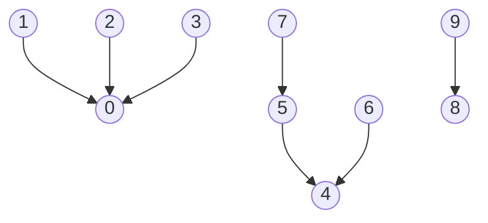

COS226, Midterm s25, 2a
Xét biểu diễn parent-link dưới đây của một cấu trúc dữ liệu weighted quick union (link-by-size):

            `Lời giải`

Trường hợp 1 : parent[8] = 8 
Ta thấy hoàn toàn hợp lệ nếu không nối 8 với bất kì gốc nào và chỉ cần thực hiện union(8,9) từ đầu.
`Hợp lệ` 

Trường hợp 2 : parent[8] = 9
Không hợp lệ vì 9 đang trỏ vào 8
`Không hợp lệ`

Trường hợp 3 : parent[8] = 0. 
Hoàn toàn hợp lệ vì nút 0 đang có tổng 3 giá trị khác trỏ vào và tổng là 4 giá trị
`Hợp lệ`

Trường hợp 4 : parent[8] = [1,2,3]
Không hợp lệ vì ta có thể thấy nếu xét các nút này nếu đã trỏ vào 0 thì theo WQU thì 8 sẽ phải trỏ vào 0 chứ không phai trỏ vào 3 số này
Nhưng nếu 3 số này khi chỉ là số đơn thì cũng khồng hợp lệ bởi nhóm của 8 có 2 số còn các số này chỉ đơn lẻ nên theo WQU thì phải gộp vào nhánh 8
`Không hợp lệ`

Trường hợp 5 : parent[8] = 4
Hoàn toàn hợp lệ bởi nhóm 4 có 4 giá trị còn nhóm 8 có 2 giá trị nên 8 hoàn toàn có thể trỏ vào 4.
`Hợp lệ`

Trường hợp 6 : parent[8] = [6,7]
Hoàn toàn không hợp lệ.
trường hợp số 6 hoàn toàn giống với trường hợp 4
8 cũng không thể nhận 7 bởi 7 gán vào 5.
`Không hợp lệ`

TH7: parent[8] = 5
Không hợp lệ bởi nếu 8 gán vào 5 thì nhóm 5 sẽ có 5 giá trị
Khi đó khi nối với nhóm 4 thì nhóm 4 có 2 còn nhóm 5 có 4 nên 5 không thể gán vào 4 được
`Không hợp lệ`

